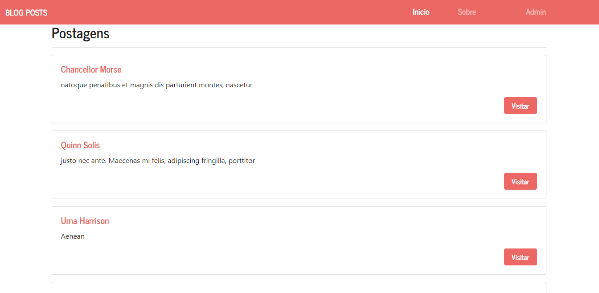

<kbd>

</kbd>
 
<h1>Mini blog para estudos de padrão MVC em PHP (Não tem o intuito de ser bonito)</h1>

Antes de começar você precisará ter instalado em sua máquina o seguite:

<ul>
    <a href="https://git-scm.com">Git: https://git-scm.com</a>
     
    <a href="https://www.php.net/downloads.php">PHP: https://www.php.net/downloads.php</a>
     
</ul>

### Rodando o Site

<ul>
    <li>Abra o terminal na pasta do projeto.</li>
    <li>Execute "php -S localhost:8080" sem aspas.</li>
    <li>Verifique se a porta 8080 não é usada em outro projeto. </li>
    <li>Caso seja mude a porta no comando acima.</li>
    <li>Antes de abrir o site você precisa do banco de dados mysql.</li>
    <li>Na pasta raiz deste projeto tem o arquivo database.sql.</li>
    <li>Abra ele e execute os comandos de criação.</li>
    <li>Agora é só acessar a url do servidor "localhost:8080" no seu navegador.<3</li>
</ul>

### Tecnologias

As seguintes ferramentas foram usadas na construção do projeto:

<ul>
    <li>Html</li>
    <li>CSS</li>
    <li>Bootstrap</li>
    <li>PHP</li>
</ul>

### Autor

<a href="">
 
  
 <b>Carlos Eduardo</b></a>

Feito com ❤️ por Carlos Eduardo

<a href="mailto:carloseduardodiasbatista@gmail.com">Entre em contato</a>

